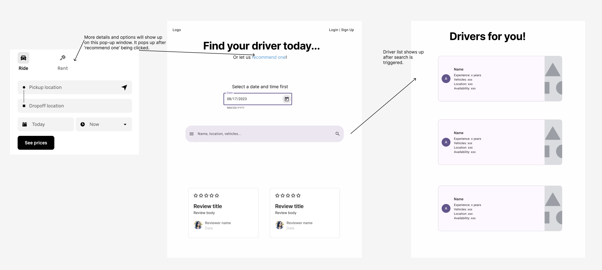

# Uber for Trucks Project Proposal

## Project Title

## Project Summary

## Project Description

## Challenging features

## Usefulness

## Realness

In order to build a real Uber-for-Trucks application, we have identified and integrated multiple datasets that cover travel times, traffic predictions, weather conditions, and GPS information. These datasets will be used to support the core functionalities of the application, such as route optimization, live tracking system, and pricing calculations.

**1. Uber Travel Movement Data(Boston)**
- **Data Source(Format)**: [Kaggle: Uber Travel Movement Data - 2 Billion Trips](https://www.kaggle.com/datasets/ishandutta/uber-travel-movement-data-2-billion-trips?select=Travel_Times+-+Boston.csv)(CSV)
- **Data Size**: Extremely high cardinality, covering over 2 billion trips, and moderate degree
- **Description**: This dataset provides detail information on pickup and drop-off locations, travel time in minutes, and trip distances. It can be used to simulate travel patterns of trucks and help calculate the estimated arrival time for goods deliveries.

**2. Traffic Prediction Dataset**
- **Data Source(Format)**: [Kaggle: Traffic Prediction Dataset](https://www.kaggle.com/datasets/fedesoriano/traffic-prediction-dataset)(CSV)
- **Data Size**: Medium cardinality and high degree
- **Description**: This dataset includes historical traffic patterns and traffic volume data, which will be used to predict future traffic conditions. It contains information such as traffic volume, speed, and congestion levels across different locations and time periods.

**3. Weather Data**
- **Data Source(Format)**: [Kaggle: Weather Data](https://www.kaggle.com/datasets/bhanupratapbiswas/weather-data)(CSV)
- **Data Size**: Medium cardinality and moderate degree
- **Description**: This dataset provides historical weather data, including temperature, wind speed, precipitation, and humidity. The data covers multiple regions in the America, which is suitable for simulating weather impacts on truck deliveries.

**4. OpenStreetMap(North America)**
- **Data Source(Format)**: [Geofabrik: North America OSM Dataset](https://download.geofabrik.de/north-america-latest.osm.pbf)(XML)
- **Data Size**: High cardinality and high degree
- **Description**: This dataset provides detailed geospatial data and captures the geographical coordinates of roads and infrastructure, which is essential for GPS-based tracking and routing functionalities in the application.

**API settings that might be used in the future**

We have also find some useful APIs that can use to increase the functionality of the application.

**1. Real-Time Weather API**
- **API LINK**: [OpenWeatherMap API](https://openweathermap.org/api)
- **Purpose**: The OpenWeatherMap API provides real-time weather updates such as temperature, precipitation, wind speed, and severe weather alerts.

**2. Real-Time Traffic API**
- **API LINK**: [Google Maps Traffic API](https://developers.google.com/maps/documentation/traffic)
- **Purpose**: The Google Maps Traffic API have the access to real-time traffic conditions, including congestion and road incidents, which can be integrate into the live truck system.

## Functionality

**CRUD operations of profiles and keyword search functionality:**

- **Profile Creation:** Drivers can create detailed profiles that include their experience, available vehicle types (e.g., small vans, box trucks, flatbeds), availability, location, and expected price.
- **Profile Search:** Users can search for driver profiles based on various criteria such as name, location, experience, vehicle types, availability, and price.
- **Profile Updates:** Drivers can update their profiles to reflect changes in their availability, experience, or other details.
- **Profile Deletion:** Drivers have the ability to delete their profiles when necessary.

**Advanced Database Feature (stored procedure(s), transaction(s), constraints, and trigger(s)):**

- **Stored Procedure (Recommendation Feature):**  
  Our application will include a recommendation system (for users who are unsure how to filter drivers and need a smart recommendation) implemented via stored procedures. This feature will allow users to input details such as source, destination, goods size, budget (affordable price), and preferred time. Based on this input, the stored procedure will return a list of available drivers along with the expected price.

- **Transactions:**  
  Transactions ensure consistency by grouping multiple operations so that they either succeed or fail as a whole. For example, when a user books a ride, a transaction will handle updating the driver's availability, inserting a new record in the Rides database, and other related operations. If any part of the process fails, the entire transaction will be rolled back, maintaining data integrity.

- **Constraints:**  
  We will apply constraints to drivers' profiles to ensure data integrity and enforce business rules. Examples include constraints on the format of driver information (such as email format validation) and ensuring that required fields (like vehicle type, availability, or rates) are properly filled.

- **Triggers:**  
  A trigger will be implemented to automatically update a driver's rating after a ride is completed and user feedback is submitted. When a new feedback entry is added, the trigger will calculate the driver's new average rating based on all submitted feedback and update the driver's profile accordingly.

**Other Features:**

- The application will provide a real-time tracking system for trucks during transportation. This feature will utilize GPS services to track the current location of the vehicle and display the estimated time of arrival (ETA) to the destination. Moreover, the tracking system might integrate other APIs as well, such as traffic data APIs, local weather data, and pricing trends for transportation services.

**UI Mockup:**

**Project Work Distribution:**

- Jun Wen: Profile CRUD and key word search; Stored procedures, transactions, constraints, and triggers; Frontend & backend interface.

- Bo Zhu: Stored procedures, transactions, constraints, and triggers; Route optimization algorithm; Live Tracking system.

- Hewei Tang: Route optimization algorithm; Live Tracking system; integrating APIs.

- Nuoxing Shang: Route optimization algorithm; integrating APIs; Frontend & backend interface; GCP hosting.
